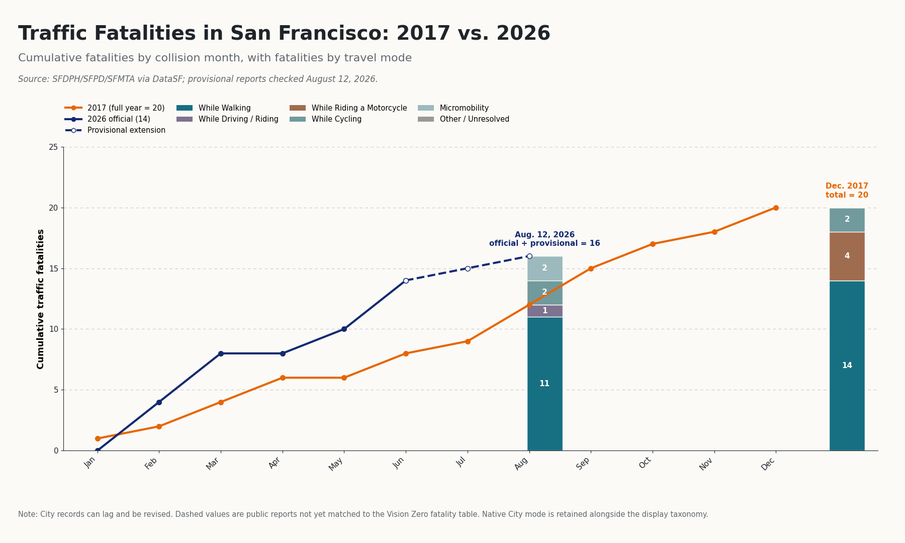

# SF Traffic Fatality Tracker

**Live dashboard:** [sf-traffic-fatality-tracker.vercel.app](https://sf-traffic-fatality-tracker.vercel.app/)

**Current release:** Vercel web edition, launched September 4, 2026

An open-source, revision-aware tracker for traffic fatalities in San Francisco. It fetches the City’s official Vision Zero fatality records from DataSF, preserves every source snapshot, keeps recent public reports separate until reconciliation, and serves a permanent Vercel-hosted Next.js dashboard for year-to-year comparison and downloads. The original Streamlit application is retained as a legacy interface, not the primary deployment.

Research by **William W. Riggs**. Source code, methodology, and revision history are maintained in this repository.

The tracker is designed for journalists, researchers, students, and residents who need to answer not only “what is the current count?” but also “what did the City publish last time, and what changed?”



The supplied visual is retained as `assets/reference_chart.png`; the image above is regenerated from the stored official and provisional records.

## Current deployment

The primary public version is the [Vercel web edition](https://sf-traffic-fatality-tracker.vercel.app/), deployed from the `web/` application in this repository. It adds a responsive interface, two-year and multi-year cumulative comparisons, a 100%-normalized mode view, record and map exploration, CSV downloads, and browser-based comparison of any two stored snapshots.

The deployment separates presentation from data collection:

- the Python pipeline queries DataSF, validates and normalizes records, stores immutable Parquet snapshots, and records revisions;
- GitHub Actions runs that pipeline daily and exports browser-ready JSON to `web/public/data/`;
- the Vercel application loads the latest published tracker payload and requested snapshots from the repository at runtime, so data refreshes do not require a frontend rebuild;
- unreconciled public reports remain visibly separate from official City records throughout the interface.

The Vercel project is `sf-traffic-fatality-tracker` in William Riggs’ personal Vercel workspace. Production uses the stable `sf-traffic-fatality-tracker.vercel.app` domain; timestamped deployment URLs are build artifacts rather than the canonical public address. The former [Streamlit deployment](https://sf-traffic-fatality-tracker.streamlit.app/) remains available only as a legacy reference.

## What it does

- Queries DataSF’s dedicated **Traffic Crashes Resulting in Fatality** API view (`dau3-4s8f`).
- Writes timestamped raw JSON plus a source manifest under `data/raw/YYYY-MM-DD/`.
- Normalizes official records to Parquet without discarding the City’s native mode.
- Compares each official snapshot with the prior snapshot.
- Logs additions, removals, mode reclassifications, date corrections, and location corrections.
- Keeps manually auditable recent reports in `data/provisional/incidents.csv`.
- Requires an explicit official record ID before a provisional incident is reconciled and removed from the combined count.
- Calculates monthly, cumulative, YTD, same-date comparison, mode shares, rolling 12-month, seasonality, and days-since-last-event metrics.
- Provides interactive charts, a map, exact record downloads, and downloadable snapshot comparisons.
- Supports a two-year detail view with modal endpoint stacks and a multi-year trend view with up to six selected years.
- Switches the annual mode chart between fatality totals and a 100%-normalized proportional breakdown.

## Why the official source changed from the original handoff

The initial brief named the victim-level injury table (`nwes-mmgh`). During implementation, DataSF’s live catalog exposed a more authoritative dedicated view: `dau3-4s8f`. Its metadata states that year-to-date records originate with Office of the Chief Medical Examiner death records and include cases that meet the multi-agency **San Francisco Vision Zero Fatality Protocol**.

That dedicated view is now canonical. The victim-level table remains a useful cross-check but does not define the official KPI. Extract totals are not assumed to equal every published year-end report: the current DataSF table contains 29 fatalities for 2016, while [SFDPH’s 2024 year-end report](https://www.visionzerosf.org/wp-content/uploads/2025/08/Vision-Zero-2024-End-of-Year-Traffic-Fatality-Report.pdf) lists 32. The source of that difference is not documented, so the tracker discloses it rather than silently substituting a value.

## Run locally

### Vercel web edition

The production interface lives in `web/` and uses the processed snapshots exported by the Python pipeline.

```bash
python scripts/export_web_data.py
cd web
pnpm install
pnpm dev
```

Open `http://localhost:3000`. The exported app is fully static: the current dashboard payload is written to `web/public/data/tracker.json`, while individual immutable snapshots are written separately and loaded only when requested.

### Data pipeline and legacy Streamlit interface

Python 3.11 or newer is required.

```bash
python -m venv .venv
source .venv/bin/activate
python -m pip install -e ".[dev]"
python -m src.refresh
streamlit run app.py
```

Then open the local URL printed by Streamlit, normally `http://localhost:8501`.

A Socrata token is optional for low-volume use. For more generous API limits:

```bash
export SOCRATA_APP_TOKEN="your-token"
python -m src.refresh
```

Useful shortcuts:

```bash
make test
make refresh
make app
```

Regenerate the publication PNG without opening Streamlit:

```bash
python -m src.export --comparison-year 2017 --current-year 2026 \
  --as-of 2026-08-12 --output assets/generated_2017_vs_2026.png
```

## Data model and provenance

### Official records

Canonical dataset: [DataSF Traffic Crashes Resulting in Fatality](https://data.sfgov.org/d/dau3-4s8f)

The analytical grain is one deceased person, not one crash. Multiple people killed in the same crash remain separate rows. Under the City protocol, the official total generally covers a death within 30 days of a crash in San Francisco’s public right-of-way. Most freeway deaths, Presidio incidents, and SFO incidents are excluded; qualifying freeway-ramp incidents at a City intersection and certain above-ground light-rail fatalities can be included. See the [Vision Zero Traffic Fatality Protocol](https://www.visionzerosf.org/wp-content/uploads/2024/02/Vision-Zero-Traffic-Fatality-Protocol_2020_6.2.pdf).

The processed file keeps:

- tracker record ID, crash ID, and person ID;
- collision date/time and death date;
- collision year and month;
- City-native deceased mode and collision type;
- normalized display mode;
- severity/protocol status;
- latitude, longitude, location, neighborhood, police district, and supervisor district;
- DataSF dataset ID, row `data_as_of`, portal load time, and tracker ingest time;
- official/provisional and classification status fields.

Charts group fatalities by **collision date**. Death date remains in every record and download because a death can occur after the collision. DataSF calendar fields are retained as unzoned source-local calendar values; tracker fetch and revision-observation timestamps use UTC.

Freshness dates have distinct meanings: `fetched_at` is the tracker pull, `data_loaded_at` is the portal load, `data_as_of` is retained as a row-level source field, the latest collision date is the newest published event, and `provisional_checked_through` is the manual public-report review date. DataSF describes this dataset as quarterly even though the tracker checks it daily; neither the official extract nor the provisional layer should be described as real time. Same-date comparisons use the latest published collision when only official records are shown, or the manual review-through date when the provisional layer is included; row-level `data_as_of` is not treated as a dataset-wide coverage date.

### Provisional records

`data/provisional/incidents.csv` is deliberately small and reviewable. Inclusion requires an identifiable incident, incident or death date, reported mode, location, durable public source, review date, and enough detail to screen for duplication. The layer is manually curated and is not an exhaustive census of recent traffic deaths.

Open provisional statuses are `unreconciled`, `provisional`, and `under-review`. Reconciliation is a validated state pair: `status=reconciled` requires a non-empty `matched_official_record_id`, and a matched ID requires that status. Other documented terminal outcomes, such as protocol exclusion or duplication, can stop contributing without an official match. The candidate matcher can flag one official record within 14 days and the same normalized mode, but it never auto-reconciles and location is not currently part of candidate scoring.

Public reporting can describe a death that City agencies later exclude under the Vision Zero Fatality Protocol. That is why the dashboard draws provisional values with a dashed line, labels the official count separately, and avoids calling the combined count “official.”

### Mode normalization

The City-native `deceased` value is preserved. The display taxonomy is:

| Native examples | Display mode |
|---|---|
| Pedestrian | While Walking |
| Bicyclist | While Cycling |
| Standup Powered Device Rider, scooter | Micromobility |
| Motorcyclist | While Riding a Motorcycle |
| Driver, Passenger | While Driving / Riding |
| Moped, unrecognized, or missing | Other / Unresolved |

A scooter is never silently counted as a bicycle. DataSF currently exposes `Moped` as a separate native value; those rows remain in Other / Unresolved until the project adopts and documents a specific moped grouping.

## Snapshot and revision behavior

Every successful refresh creates:

```text
data/
├── raw/YYYY-MM-DD/
│   ├── dau3-4s8f_<UTC timestamp>.json
│   └── manifest_<UTC timestamp>.json
├── processed/
│   ├── snapshots/fatalities_<UTC timestamp>.parquet
│   ├── fatalities.parquet
│   ├── combined.parquet
│   ├── provisional_audit.parquet
│   ├── revisions.parquet
│   └── status.json
└── provisional/incidents.csv
```

The first snapshot is a baseline. It does not create hundreds of fake “addition” revisions. Later snapshots are compared by stable official record ID. Revision rows contain the two snapshot names, observation time, record ID, change type, changed field, and old/new value. Latitude and longitude changes smaller than `0.000001°` (roughly 11 cm of latitude) are ignored as serialization noise.

Because the revision log is derived from immutable snapshots, it can be reproduced with `python -m scripts.rebuild_revisions`, followed by `python scripts/export_web_data.py` to refresh the browser payload.

Before replacing the processed snapshot, the pipeline rejects empty payloads, missing or duplicate record IDs, invalid collision dates, missing deceased modes, and a sudden loss of more than 20% of records. A failed fetch or validation returns a nonzero exit status and records the attempt in `status.json`; it does not replace a good processed snapshot.

## Dashboard guide

- **Overview**: scan-first KPIs, a two-year detail or multi-year trend view, mode composition, annual history, and seasonality. Historical selections use full-year/December labels; the latest year uses its actual checked-through date.
- **Explore records**: filter by year, normalized mode, and status; inspect a location map; download exact rows.
- **Snapshots & revisions**: compare any two stored snapshots, download the diff, inspect the persistent revision log, and review provisional matches.
- **About & methods**: definitions, caveats, source links, deployment details, and the reconciliation policy.

Plotly’s camera control exports any visible chart from the browser. Every chart view can also be downloaded as a self-contained interactive HTML file, and the two-year detail view has a dedicated publication PNG export using a headless-safe Matplotlib renderer. The command-line exporter will use Kaleido when the optional `plotly-png` extra and a working Chrome runtime are available, then fall back to Matplotlib automatically.

## Automated refresh

`.github/workflows/refresh.yml` runs tests, refreshes DataSF daily, and commits changed data. Add a repository secret named `SOCRATA_APP_TOKEN` if desired. GitHub Actions needs `contents: write`, already declared in the workflow.

The production dashboard is deployed from the `web/` root directory on Vercel. It loads the latest tracker payload and requested immutable snapshots from the `main` branch at runtime, so the scheduled refresh becomes visible without rebuilding the site. Connecting the Vercel project to this GitHub repository additionally enables preview deployments for pull requests and automatic production deployments for code changes merged to `main`.

The Streamlit deployment and `app.py` remain available as a legacy reference. New public links should point to the Vercel application.

## Testing

```bash
python -m pytest -q
```

Tests cover source-mode normalization, official/provisional metric separation, same-date comparison, explicit provisional reconciliation, and the full revision taxonomy.

## Limitations

- Official publication lags collisions and can be revised later.
- DataSF publishes the canonical extract quarterly; daily polling does not make it a real-time source.
- The Vision Zero Fatality Protocol can exclude deaths that appear traffic-related in initial reporting.
- The manually curated provisional list is not exhaustive; public reports can be incomplete, wrong, duplicated, or later reclassified.
- Current extract totals can differ from SFDPH’s frozen year-end reports; 2016 is 29 in DataSF versus 32 in the 2024 year-end report.
- Small annual counts are volatile and year-to-year differences do not establish causation.
- Coordinates are DataSF’s geocoded collision locations and can be generalized to a street segment or intersection.
- Monthly charts use collision month, not death month.
- The dashboard is an independent analysis and must not be attributed to the City and County of San Francisco.

Review the City dataset metadata before republishing analysis. Attribute the data to **Vision Zero SF / TransBASE via DataSF**, include the pull date, link the original dataset, retain the caveats, and do not attribute this project’s analysis to the City.

## Contributing

Issues and pull requests are welcome. For a provisional incident correction, include a durable source URL, explain the requested status or mode change, and never add personally identifying information unless it is necessary and already clearly public.

## License

Code is MIT licensed. The DataSF source is published under the [Open Data Commons Public Domain Dedication and License](https://opendatacommons.org/licenses/pddl/1-0/); its metadata and use caveats remain applicable. News links are provenance references, not redistributed article content.
